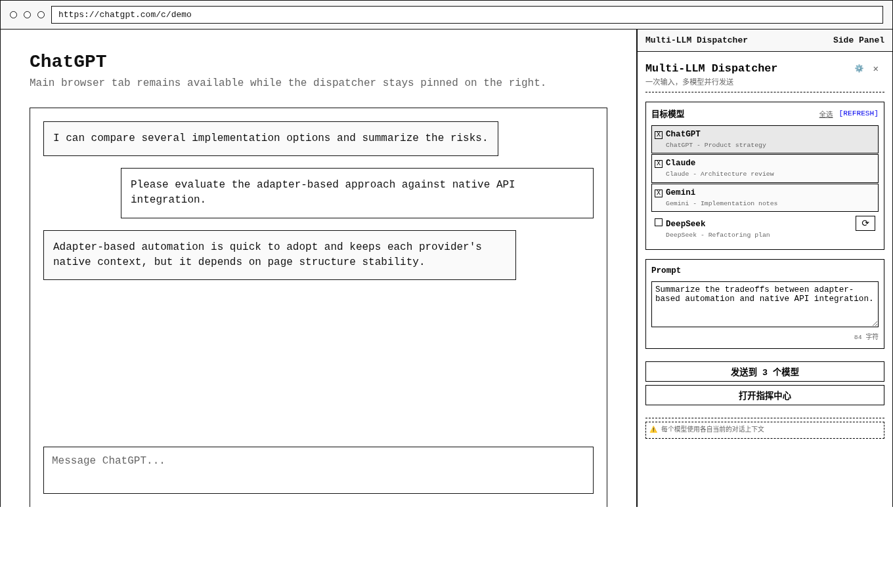

<p align="center">
  
</p>

<h1 align="center">Multi-LLM Prompt Dispatcher</h1>

<p align="center">
  Send one prompt to multiple AI web applications from a Chromium extension.
</p>

<p align="center">
  <a href="README.zh-CN.md">简体中文</a>
</p>

<p align="center">
  <a href="LICENSE"></a>
  <a href="extension/manifest.json"></a>
  
</p>

Multi-LLM Prompt Dispatcher is a Manifest V3 browser extension for dispatching the same prompt to multiple AI web applications. It works through the official web interfaces of each provider, so you can compare responses without repeatedly copying the same prompt into every tab.

The extension does not require provider API keys. It scans supported AI tabs, sends prompts through platform-specific adapters, and provides a command center for monitoring active model responses.

## Preview

The screenshots below show representative local extension states with sample model tabs.

### Popup Dispatcher


### Pinned Side Panel



### Command Center


### Settings


## Highlights

| Capability | Description |
| --- | --- |
| Parallel prompt dispatch | Send one prompt to selected AI tabs at the same time. |
| Platform adapters | Keep provider-specific DOM and interaction logic isolated. |
| Command center | Monitor multiple model responses from a dedicated dashboard. |
| Side panel support | Pin the dispatcher as a Chromium side panel for repeated use. |
| Prompt history | Store sent prompts locally and export history as JSON. |
| Window-scoped scanning | Limit detected targets to the current browser window when needed. |

## Supported Platforms

| Platform | Hosts | Adapter status |
| --- | --- | --- |
| ChatGPT | `chat.openai.com`, `chatgpt.com` | Implemented |
| Claude | `claude.ai` | Implemented |
| Gemini | `gemini.google.com` | Implemented |
| Google AI Studio | `aistudio.google.com` | Implemented |
| Grok | `grok.x.ai`, `grok.com` | Implemented |
| DeepSeek | `chat.deepseek.com` | Implemented |
| Qwen and Tongyi | `chat.qwen.ai`, `tongyi.aliyun.com`, `qianwen.aliyun.com` | Implemented |
| Doubao | `doubao.com`, `www.doubao.com` | Implemented |

The manifest also reserves host permissions for Zhipu, MiniMax/Hailuo, and Kimi. Those platforms should be treated as reserved targets until dedicated adapters are implemented and verified.

## Installation

This repository is distributed as an unpacked Chromium extension. You can install it from a release zip or from a local checkout.

### From GitHub Releases

1. Download `multi-llm-prompt-dispatcher-vX.Y.Z.zip` from [GitHub Releases](https://github.com/quboliu/multi-prompt-dispatcher/releases).
2. Unzip the package.
3. Open the Chromium extension manager:

   ```text
   chrome://extensions/
   ```

4. Enable Developer mode.
5. Select Load unpacked.
6. Choose the unzipped package directory.

### From Source

1. Clone the repository:

   ```bash
   git clone https://github.com/quboliu/multi-prompt-dispatcher.git
   ```

2. Open the Chromium extension manager:

   ```text
   chrome://extensions/
   ```

3. Enable Developer mode.
4. Select Load unpacked.
5. Choose the `extension/` directory from this repository.
6. Pin the extension from the browser toolbar if you want quick access.

No build step is required for local use.

## Usage

1. Open the AI web applications you want to use and sign in to each provider.
2. Open the extension popup.
3. Select the target model tabs.
4. Enter a prompt.
5. Send the prompt to the selected tabs.
6. Open the command center when you want a larger monitoring view.

Each provider keeps its own native conversation context. The extension synchronizes the send action, not the chat history across providers.

## Settings

| Setting | Purpose |
| --- | --- |
| Reuse existing dashboard tab | Reopen an existing dashboard tab instead of creating duplicates. |
| Current Window Only | Detect AI tabs only in the current browser window. |
| Enable history tracking | Store sent prompts in extension storage. |
| Maximum history entries | Limit the number of retained prompt history items. |

## Keyboard Shortcuts

| Shortcut | Action |
| --- | --- |
| `Ctrl+Shift+M` | Open the extension action popup. |
| `Alt+Shift+D` | Open the command center. |

## Disclaimer

This project is not affiliated with OpenAI, Anthropic, Google, xAI, DeepSeek, Alibaba, ByteDance, or any other listed provider. Use it responsibly and follow each provider's terms of service.

## License

Distributed under the MIT License. See [LICENSE](LICENSE) for details.
