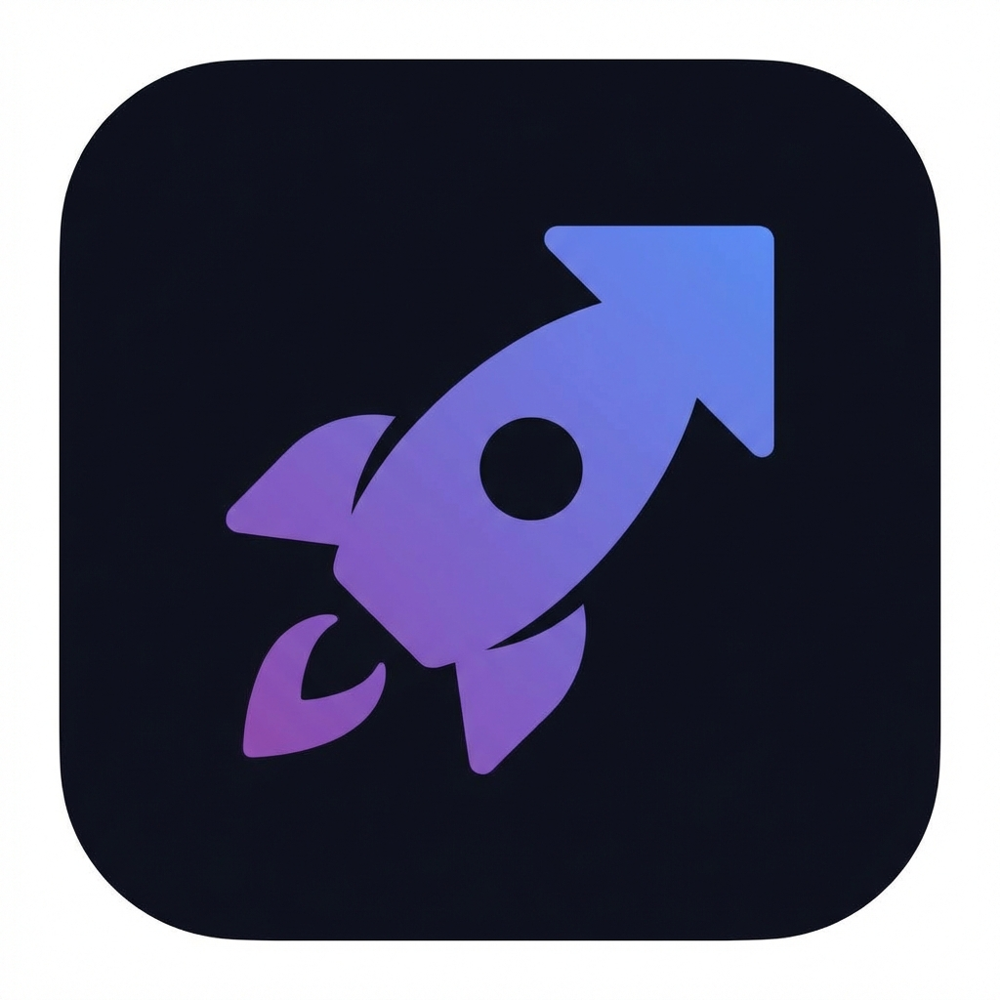
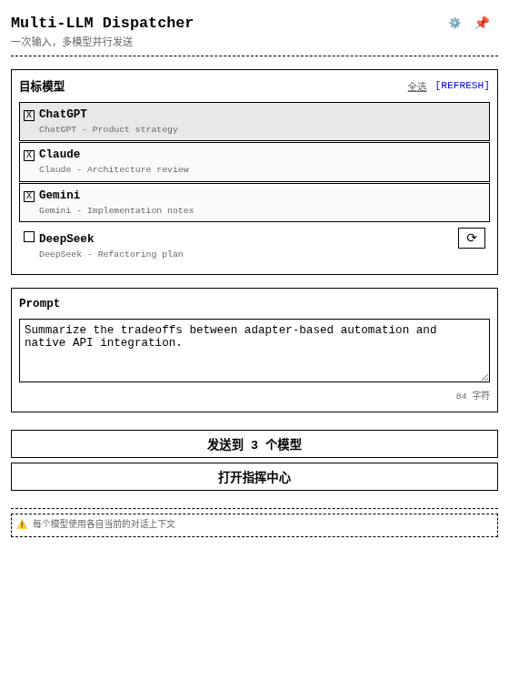
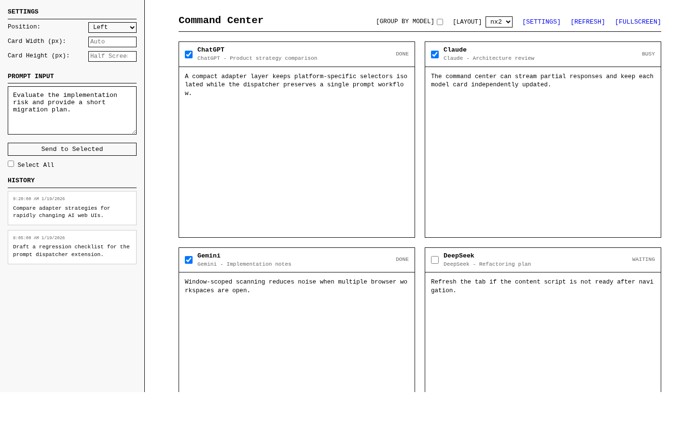
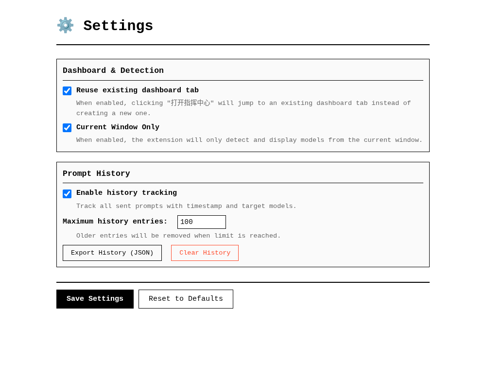

<p align="center">
  
</p>

<h1 align="center">Multi-LLM Prompt Dispatcher</h1>

<p align="center">
  通过 Chromium 扩展将同一个 prompt 发送到多个 AI 网页应用。
</p>

<p align="center">
  <a href="README.md">English</a>
</p>

<p align="center">
  <a href="LICENSE"></a>
  <a href="extension/manifest.json"></a>
  
</p>

Multi-LLM Prompt Dispatcher 是一个 Manifest V3 浏览器扩展，用于将同一个 prompt 分发到多个 AI 网页应用。它通过各平台官方网页界面工作，适合在多个模型之间快速对比回答，减少重复复制和粘贴。

该扩展不需要模型供应商 API Key。它会扫描受支持的 AI 标签页，通过平台专用适配器发送 prompt，并提供指挥中心用于监控活跃模型响应。

## 预览

以下截图展示的是带示例模型标签页的本地扩展状态。

### 弹窗分发器



### 指挥中心



### 设置页



## 亮点

| 能力 | 说明 |
| --- | --- |
| 并行 prompt 分发 | 将同一个 prompt 同时发送到选中的 AI 标签页。 |
| 平台适配器 | 将不同供应商的 DOM 与交互逻辑隔离在各自适配器中。 |
| 指挥中心 | 在独立 dashboard 中监控多个模型响应。 |
| 侧边栏支持 | 可将分发器固定为 Chromium 侧边栏，便于重复使用。 |
| Prompt 历史 | 本地保存已发送 prompt，并支持导出 JSON。 |
| 当前窗口扫描 | 需要时仅检测当前浏览器窗口中的目标标签页。 |

## 支持平台

| 平台 | 域名 | 适配器状态 |
| --- | --- | --- |
| ChatGPT | `chat.openai.com`, `chatgpt.com` | 已实现 |
| Claude | `claude.ai` | 已实现 |
| Gemini | `gemini.google.com` | 已实现 |
| Google AI Studio | `aistudio.google.com` | 已实现 |
| Grok | `grok.x.ai`, `grok.com` | 已实现 |
| DeepSeek | `chat.deepseek.com` | 已实现 |
| 通义千问 / Qwen | `chat.qwen.ai`, `tongyi.aliyun.com`, `qianwen.aliyun.com` | 已实现 |
| 豆包 | `doubao.com`, `www.doubao.com` | 已实现 |

Manifest 中还预留了智谱、MiniMax/海螺、Kimi 等平台权限。这些平台在专用适配器实现并验证前，应视为预留目标。

## 安装

当前仓库以未打包 Chromium 扩展形式分发。你可以从 release zip 安装，也可以从本地源码安装。

### 从 GitHub Releases 安装

1. 从 [GitHub Releases](https://github.com/quboliu/multi-prompt-dispatcher/releases) 下载 `multi-llm-prompt-dispatcher-vX.Y.Z.zip`。
2. 解压该 package。
3. 打开 Chromium 扩展管理页：

   ```text
   chrome://extensions/
   ```

4. 开启开发者模式。
5. 点击加载已解压的扩展程序。
6. 选择解压后的 package 目录。

### 从源码安装

1. 克隆仓库：

   ```bash
   git clone https://github.com/quboliu/multi-prompt-dispatcher.git
   ```

2. 打开 Chromium 扩展管理页：

   ```text
   chrome://extensions/
   ```

3. 开启开发者模式。
4. 点击加载已解压的扩展程序。
5. 选择本仓库中的 `extension/` 目录。
6. 如需快速使用，可将扩展固定到浏览器工具栏。

本地使用不需要构建步骤。

## 使用方法

1. 打开需要使用的 AI 网页应用，并确认已登录对应账号。
2. 打开扩展弹窗。
3. 选择目标模型标签页。
4. 输入 prompt。
5. 将 prompt 发送到选中的标签页。
6. 需要更大的监控视图时，打开指挥中心。

每个供应商会保留自己的原生对话上下文。本扩展同步的是发送动作，而不是跨供应商同步聊天历史。

## 设置项

| 设置 | 用途 |
| --- | --- |
| Reuse existing dashboard tab | 复用已有指挥中心标签页，避免重复打开。 |
| Current Window Only | 仅检测当前浏览器窗口中的 AI 标签页。 |
| Enable history tracking | 将已发送 prompt 保存到扩展存储中。 |
| Maximum history entries | 限制保留的 prompt 历史数量。 |

## 快捷键

| 快捷键 | 动作 |
| --- | --- |
| `Ctrl+Shift+M` | 打开扩展弹窗。 |
| `Alt+Shift+D` | 打开指挥中心。 |

## 架构

```text
extension/
  manifest.json
  background/
    background.js
  content/
    adapters/
      base.js
      chatgpt.js
      claude.js
      gemini.js
      aistudio.js
      grok.js
      deepseek.js
      qwen.js
      doubao.js
    bridge.js
    content.js
    network-interceptor.js
  popup/
    popup.html
    popup.css
    popup.js
  dashboard/
    dashboard.html
    dashboard.css
    dashboard.js
  settings/
    settings.html
    settings.css
    settings.js
  icons/
```

核心流程：

1. 后台 Service Worker 扫描标签页并协调扩展消息。
2. 弹窗或指挥中心发起分发请求。
3. Content Script 为每个目标标签页选择匹配的平台适配器。
4. 适配器填充供应商网页输入框并触发原生发送动作。
5. 网络拦截器和 DOM 兜底监听将响应更新回传到扩展界面。

## 开发

本仓库没有包管理器或构建流水线。修改 `extension/` 下的文件后，在 `chrome://extensions/` 中重新加载已解压扩展即可。

常用脚本：

```bash
node scripts/validate-extension.mjs
bash scripts/package-extension.sh
node scripts/diagnostic.js
node scripts/ai_studio_inspect.js
```

修改适配器后，需要针对对应供应商网页进行手动验证，因为供应商 UI 更新可能在仓库代码不变的情况下破坏 DOM 选择器。

## CI 与发布流程

CI 会在代码变更时校验 manifest、检查 JavaScript 语法，并上传扩展 zip artifact。每周 package smoke workflow 会定期重复同一组发布面检查。Release workflow 由版本 tag 触发：

```bash
git tag v1.1.0
git push origin v1.1.0
```

Tag 必须与 `extension/manifest.json` 中的版本一致。Release 成功后会上传扩展 zip 和 SHA-256 checksum 到 GitHub Releases。

## 文档

- [测试指南](docs/TESTING.md)
- [Phase 2 指南](docs/PHASE2_GUIDE.md)
- [适配器架构](docs/adapters/README.md)
- [平台对比](docs/adapters/platform_comparison.md)
- [风险评估](docs/RISK_ASSESSMENT.md)

## 隐私

- 不需要模型供应商 API Token。
- Prompt 分发通过当前浏览器标签页完成。
- 设置和 prompt 历史保存在 Chrome 扩展存储中。
- 除非在指挥中心启用响应监控，对话内容仍保留在供应商网页中。

## 故障排查

| 问题 | 建议处理 |
| --- | --- |
| 未检测到 AI 标签页 | 刷新供应商页面，并确认 URL 匹配受支持域名。 |
| 目标标签页未就绪 | 从弹窗中重新加载该标签页，并等待页面加载完成。 |
| Prompt 发送失败 | 检查供应商是否正在生成、是否已退出登录，或输入 UI 是否已变化。 |
| 响应监控不完整 | 以供应商网页为准；监控能力取决于供应商响应传输方式。 |

## 已知限制

- 供应商网页 UI 更新可能导致基于 DOM 的适配器失效。
- 用户必须先登录各模型供应商网页。
- 部分平台可能限制类似自动化的交互，或调整输入框行为。
- 响应监控能力会因平台和响应传输方式而异。
- 本仓库尚未打包发布到 Chrome Web Store。

## 免责声明

本项目与 OpenAI、Anthropic、Google、xAI、DeepSeek、阿里巴巴、字节跳动或其他列出的供应商无官方关联。请负责任地使用，并遵守各供应商的服务条款。

## 许可证

本项目基于 MIT License 分发。详见 [LICENSE](LICENSE)。
